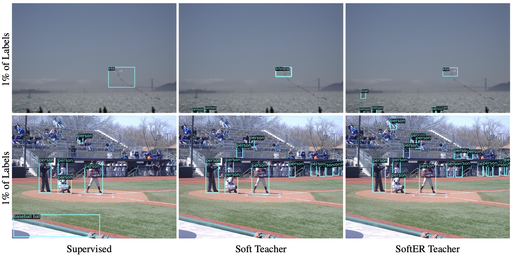

<p align="center"></p>

# LEDetection: Label-Efficient Object Detection
<span> =3.7-brightgreen" /> =1.6.0-orange" /> </span>

## Why LEDetection?
LEDetection (French pronounciation as `leuh` detection), short for *label-efficient object detection*, is an open-source toolbox focused on semi-supervised and few-shot object detection, both of which are important and emerging topics in computer vision. LEDetection enables modern detection systems to do more with less hand-labeled data, thereby alleviating the dependency on large amounts of instance-level class annotations and bounding boxes.

### Highlights and Features

* LEDetection is based on [MMDetection](https://github.com/open-mmlab/mmdetection), and PyTorch, thus inherits all of its world-class features including its modular design and high efficiency;
* Use LEDetection to train contemporary, high-performance supervised MMDetection models out-of-the-box;
* Add unlabeled data to train LEDetection models for state-of-the-art semi-supervised and few-shot detection performances.

Our goal is to expand the utility of LEDetection for the CV/ML practitioner by incorporating the latest advances in self-supervised, semi-supervised, and few-shot learning to boost the accuracy performance of conventional supervised detectors in the limited labeled data setting. If you find this work useful, let us know by starring this repo. Issues and PRs are also welcome!

### One Toolbox - Multiple Detection Paradigms
LEDetection is versatile to support multiple detection paradigms including supervised, semi-supervised, few-shot, and semi-supervised few-shot.

**Supervised Detection**

Use LEDetection to train popular supervised detection frameworks such as Faster R-CNN, Mask R-CNN, etc. See [example configs](https://github.com/lexisnexis-risk-open-source/ledetection/tree/main/configs/supervised).

**Semi-Supervised Detection**

Add unlabeled data to your LEDetection pipeline to enable robust semi-supervised detection using the implemented [Soft Teacher](https://arxiv.org/abs/2106.09018) and [SoftER Teacher](https://arxiv.org/abs/2303.05739) models. See [example configs](https://github.com/lexisnexis-risk-open-source/ledetection/tree/main/configs/semi_supervised).

**Few-Shot Detection**

LEDetection models can be re-purposed into label-efficient few-shot detectors following the simple yet effective two-stage fine-tuning approach [TFA](https://arxiv.org/abs/2003.06957). See [example configs](https://github.com/lexisnexis-risk-open-source/ledetection/tree/main/configs/few_shot).

**Semi-Supervised Few-Shot Detection**

Why not combine both semi-supervised and few-shot training protocols, on datasets with limited labels, to enable semi-supervised few-shot detection, as described in our [paper](https://arxiv.org/abs/2303.05739)? See [example configs](https://github.com/lexisnexis-risk-open-source/ledetection/tree/main/configs/semi_few_shot).

## Get Started
Getting started is quick and easy:

1. Please refer to this [installation guide](https://github.com/lexisnexis-risk-open-source/ledetection/blob/main/docs/installation.md);
2. Have fun with this [quickstart guide](https://github.com/lexisnexis-risk-open-source/ledetection/blob/main/docs/quickstart.md).

## License
We release LEDetection under the permissive Apache 2.0 license. Any contributions made will also be subject to the same licensing.

Copyright 2023 LexisNexis Risk Solutions. All Rights Reserved.

## Acknowledgments
We are grateful for the open-source contributions from 

* [PyTorch](https://pytorch.org/),
* [OpenMMLab MMDetection](https://github.com/open-mmlab/mmdetection),
* [Microsoft SoftTeacher](https://github.com/microsoft/SoftTeacher),

and many other projects by the broader CV/ML communities, without which this project would not have been possible.

## Citation
If you find this work useful, consider citing the related paper:

```
@inproceedings{TranSeeFewerDetection,
  title="{Boosting Semi-Supervised Few-Shot Object Detection with SoftER Teacher}",
  author={Tran, Phi Vu},
  howpublished={https://arxiv.org/abs/2303.05739},
  year={2023}
}
```
